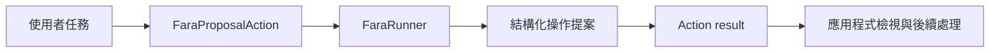

# 以 Fara 為工作流程建立可檢視的畫面操作提案

整合視覺電腦操作（Computer Use）模型的 AI 工作流程（AI Workflow）需要將模型建議與外部操作分成可觀察的兩個階段。一般 Action 可以回傳文字或結構化資料，卻沒有固定方式表達一項畫面操作的目標、輸入值、理由與來源版本，使呼叫端難以檢視模型建議並套用自己的授權流程。

Fara1.5 以螢幕截圖與對話歷程進行 observe-think-act，能提出滑鼠、鍵盤及其他操作。本文將這項能力加到 Agentic SDK 的回覆與動作模組（Action），但 Action 只產生**可檢視的操作提案**。應用程式可顯示、記錄、核准或拒絕提案，再依自己的流程決定是否執行外部操作。

## 先看工作流程新增的能力

| 工作流程輸入 | 既有流程缺少的能力 | 加入 FaraProposalAction 後的控制結果 |
| --- | --- | --- |
| 目前畫面與使用者任務 | 呼叫端需要自行解讀非固定格式的模型建議 | Action 回傳含 `kind`、`target`、`value` 與 `reason` 的結構化提案 |
| 模型提出 click、type、scroll 或 key 操作 | 建議與執行決策之間沒有可稽核的資料邊界 | 應用程式取得待檢視提案，可依自身授權流程決定後續處理 |
| Fara 服務呼叫失敗 | 外部 client 的錯誤格式無法由 workflow 統一觀察 | Action 留下固定的錯誤 entry 與 `last_action_error` |

Fara 的視覺輸入、對話歷程、client 呼叫與模型部署細節都封裝在 runner；本文聚焦它與 SDK 的交界。Fara 官方將 Fara1.5 定位為研究預覽，建議在隔離環境中監看執行並避開敏感資料或高風險領域。本文的 proposal 模式建立模型建議與應用程式執行決定之間的資料邊界。

```text
使用者任務 -> FaraProposalAction -> action result
```



!!! note "本文的責任邊界"

    `FaraProposalAction` 只產生可檢視的提案，不執行瀏覽器控制、不決定是否核准操作，也不安排下一輪流程。任何操作執行、授權與人工確認都由呼叫 workflow 的應用程式處理。

這個範例透過 `entry_module="action"` 直接開始工作流程。目的是將 Fara 與 SDK 的 Action 介面本身說清楚。

## 把模型建議變成可檢視的 Action 結果

SDK 的自訂模組只需要 `name`、`__call__(state)` 與 `ModuleOutput`。`FaraProposalAction` 將 Fara 呼叫封裝在 Action 內，輸出限制為一筆操作提案。`runner` 是應用程式提供的轉接器，刻意不假定 Fara 的特定 client API。

```python title="fara_action.py"
from typing import Literal, Protocol, TypedDict

from agentic_sdk import ContextEntry, ContextEntryType, ModuleOutput, WorkflowState


class FaraProposal(TypedDict):
    proposal_id: str
    kind: Literal["click", "type", "scroll", "key"]
    target: str
    value: str | None
    reason: str
    source_revision: str


class FaraRunner(Protocol):
    def propose(self, task: str) -> FaraProposal: ...


class FaraProposalAction:
    name = "action"

    def __init__(self, runner: FaraRunner) -> None:
        self.runner = runner

    def __call__(self, state: WorkflowState) -> ModuleOutput:
        try:
            proposal = self.runner.propose(state.latest_user_message())
        except Exception as exc:
            state.last_action_error = {"type": type(exc).__name__, "message": str(exc)}
            return ModuleOutput(
                next_module=None,
                payload={"fara_proposal": None},
                context_updates=[
                    ContextEntry(
                        type=ContextEntryType.ACTION_RESULT,
                        content=f"error:{type(exc).__name__}",
                        metadata={"ok": False, "source": "fara", "error": str(exc)},
                    )
                ],
            )

        content = str(proposal)
        state.last_action_error = None
        state.last_action_result = {"content": content, "model": "fara"}
        return ModuleOutput(
            next_module=None,
            payload={
                "latest_final_message": content,
                "fara_proposal": proposal,
            },
            context_updates=[
                ContextEntry(
                    type=ContextEntryType.ACTION_RESULT,
                    content=content,
                    metadata={"ok": True, "source": "fara", "proposal_id": proposal["proposal_id"]},
                )
            ],
        )
```

`FaraProposal` 是**本篇應用程式定義的正規化輸出**，不是宣稱為 Fara 的原生 client schema。runner 的工作是取得 Fara 所需的視覺上下文、設定超時與重試，並將供應商回傳資料轉成這六個欄位。`proposal_id` 用來追查單一提案，`kind`、`target`、`value` 與 `reason` 是應用程式檢視提案的最小欄位，`source_revision` 記錄產生提案的外部版本。實際 Fara client 的輸入與回傳格式應以 [Fara 文件](https://github.com/microsoft/fara) 為準，並隔離在 runner 實作內。

`next_module=None` 明確結束這次 Action。`payload` 讓呼叫端從 `result.entities["fara_proposal"]` 取得結構化提案；`last_action_result` 與 `context_updates` 則保留 SDK 標準的最終結果與可觀察紀錄。

## 建立只執行 Fara Action 的 workflow

```python title="app.py"
from agentic_sdk import Workflow

workflow = Workflow(
    workflow_name="畫面操作提案",
    entry_module="action",
    action=FaraProposalAction(runner=fara_runner),
)

result = workflow.run("在目前畫面中提出填入已確認值的操作。")
proposal = result.entities["fara_proposal"]
print(result.final_message)
print(proposal)
```

`proposal` 出現後不代表任何操作已發生。呼叫端要明確把它交給自己的檢視或核准流程；下面的最小例子只建立待審核紀錄，不呼叫瀏覽器或其他外部副作用。

```python title="review_proposal.py"
review_record = {
    "proposal_id": proposal["proposal_id"],
    "status": "pending_review",
    "proposal": proposal,
}
print(review_record)
```

這段 workflow 驗證 Fara Action 是否符合 SDK 的模組契約。如何呈現、核准、拒絕或執行 `review_record`，是呼叫端的後續處理，不屬於這個 Action 模組。

## 驗證 Action 輸出

下表只驗證這個模組的輸入與輸出。

| 測試情境 | 預期行為 | 需要保留的證據 |
| --- | --- | --- |
| 提出填入值操作 | 回傳一筆操作提案 | `result.entities["fara_proposal"]` |
| Fara 無法產生提案 | 將 runner 例外轉為可識別的 Action 錯誤 | `last_action_error` 與 `ACTION_RESULT` error metadata |
| Action 執行完成 | 不排程其他 SDK 模組 | `result.visit_counts` 與 `next_module=None` |

這些紀錄可用於區分 Fara 輸出差異與 SDK Action 模組契約的問題，也可作為 Fara 模型版本更新時的回歸檢查。

## 用 fake runner 驗證提案契約

測試只替換 runner，不接觸瀏覽器或其他外部操作。這能驗證 Action 正確保留提案 schema 與 Action result，並證明這個模組本身不具備執行操作的能力。

```python title="fara_action_test.py"
from agentic_sdk import WorkflowState


class FakeFaraRunner:
    def propose(self, task: str) -> FaraProposal:
        assert task == "在目前畫面中提出填入已確認值的操作。"
        return {
            "proposal_id": "proposal-001",
            "kind": "type",
            "target": "目標輸入欄位",
            "value": "confirmed-value",
            "reason": "畫面狀態顯示此欄位需要填入已確認值",
            "source_revision": "fara-1.5",
        }


state = WorkflowState(user_message="在目前畫面中提出填入已確認值的操作。")
result = FaraProposalAction(FakeFaraRunner())(state)

assert result["next_module"] is None
assert result["payload"]["fara_proposal"]["proposal_id"] == "proposal-001"
assert state.last_action_result == {"content": str(result["payload"]["fara_proposal"]), "model": "fara"}
assert result["context_updates"][0].metadata["ok"] is True
```

## 將 Fara 限定在 Action 邊界

這個模式讓開發者將 Fara 視覺提案掛入一個 SDK Action。SDK 的 `WorkflowState` 提供本輪輸入，`ModuleOutput` 提供固定的結果、狀態與紀錄格式；Fara 轉接器只負責產生提案。模型版本更新時，可分別檢查 Fara 提案內容與 Action 模組契約。

## 可直接帶走的做法

- 以 `entry_module="action"` 驗證 Fara Action，不混入其他 workflow 模組。
- 將 Fara client 差異封裝在 `FaraRunner`，讓 Action 只依賴一個提案介面。
- 以 `payload` 保存結構化提案，以 `context_updates` 保留可觀察的 Action 結果。
- 將 Fara 輸出轉成符合 Agentic SDK 規範的 Action 結果。

## 成果總結與展望

完成這個整合後，使用者可以把自然語言任務轉成可檢視的 Fara 操作提案，並從同一個 Action 結果取得提案內容與產生紀錄。這讓畫面理解模型的輸出進入 SDK 固定的 `payload` 與 `ContextEntry` 介面；呼叫端可以依自己的流程接續處理提案，而不必解析特定 Fara client 的回傳格式。

若要將此能力納入 Agentic SDK 原生支援，適合在 Action 家族提供可選的 `FaraProposalAction`，並以 `FaraRunner` 作為唯一外部依賴。原生模組應固定提案的 payload 欄位與 Action result metadata，但不承擔操作執行。這樣 Fara 的服務端點或 client API 改動可限制在 runner 實作，既有應用程式則仍以同一個 SDK Action 契約取得提案。

## 參考資料

- [Fara GitHub 專案](https://github.com/microsoft/fara)
- [Fara 論文](https://arxiv.org/abs/2606.20785)
- [回覆與動作模組](../modules/action-modules.md)
