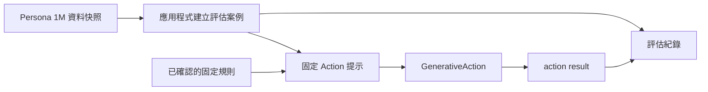

# 以 MatrAIx Persona 1M 盤查工作流程回覆的一致性

一般 AI 工作流程（AI Workflow）的 Action 測試常以單一問題與單一預期回覆驗證功能。這種測試無法揭露同一個已確認事實在不同使用者脈絡下是否被遺漏、弱化或改寫。回覆可以依讀者需要調整說明深度與表達方式，但受控規則、產品事實與必要限制必須維持一致。

MatrAIx 論文提出 Persona 8B 與約一百萬筆 quality-filtered persona coreset，使用 1,290 個類別維度描述模擬使用者，目的在於評估 AI 系統與數位產品。本文將 Persona 1M 用作**離線 Action 評估情境來源**：應用程式從已核准的 persona 維度建立測試案例，`GenerativeAction` 產生回覆，再比較不同 persona 情境下的必要事實是否一致。本文不將資料集視為可直接投入生產 `system_prompt` 的指示 API。

## 先看工作流程新增的能力

| 工作流程輸入 | 既有流程缺少的能力 | 加入 Persona 1M 評估情境後的控制結果 |
| --- | --- | --- |
| 已確認的固定事實 | 單一測試無法發現它在不同脈絡下被改寫 | 固定事實搭配多種 persona 情境，檢查每份 Action 回覆都保留必要內容 |
| 多樣化模擬使用者脈絡 | 測試者只能依直覺手寫少數提示 | 由已核准的 persona 維度建立可重跑的情境紀錄 |
| Persona 資料快照更新 | 無法分辨回覆差異來自模型或測試情境 | 比對 persona 資料版本、選用維度、模型設定與 Action 回覆 |

本文以一條固定規則作為抽象案例：精簡、逐步說明與正式表達等情境可以產生不同措辭，但每份回覆都必須保留相同的必要事實。

```text
Persona 1M 已核准維度 -> 評估案例 -> GenerativeAction -> 回覆與評估紀錄
```



!!! note "本文的責任邊界"

    Persona 1M 的下載、授權、欄位挑選與情境設計都在建立 Action 前完成。本文只處理 Action 回覆如何進入可重跑的 persona 評估；它不把 persona 記錄當作 production prompt，也不負責資料查找或回覆檢查模組。

## 將 Persona 1M 資料縮成可重跑的評估案例

論文公開的是大量 persona 記錄與類別維度，而不是 Action 提示詞 API。應用程式應先依資料使用條件挑選少量、與工作流程測試相關的維度，並保存資料快照或版本識別。下列 `PersonaEvaluationCase` 是本篇應用程式的測試資料模型，不是假定的 MatrAIx 原生 schema。

```python title="persona_evaluation_case.py"
from dataclasses import dataclass


@dataclass(frozen=True)
class PersonaEvaluationCase:
    case_id: str
    dataset_revision: str
    selected_dimensions: dict[str, str]
    user_question: str
    required_fact: str


case = PersonaEvaluationCase(
    case_id="fixed-fact-step-by-step-001",
    dataset_revision="persona-1m-snapshot-2026-08",
    # 這是應用程式從已核准 persona 維度映射出的分析標籤，
    # 不是宣稱為 Persona 1M 的原生欄位名稱。
    selected_dimensions={"response_style_group": "step_by_step"},
    user_question="這項固定規則在這個情況是否仍適用？",
    required_fact="必要限制為 7 天",
)
```

這個案例不將完整 persona 記錄送給模型。`selected_dimensions` 是應用程式正規化後的分析標籤，只用於分組與分析，例如找出「偏好逐步說明」的測試案例是否比其他案例更常遺漏必要事實；它不是 Persona 1M 原生 schema 的宣稱。模型收到的仍是固定工作規則與必要事實。

## 用固定 Action 產生可比較的回覆

以下 workflow 從 Action 開始，刻意只配置本篇的 Action 模組。固定提示要求回覆包含已確認條款；persona case 不改寫提示，只提供評估標籤與同一個使用者問題。

```python title="app.py"
import os

from agentic_sdk import Workflow
from agentic_sdk.modules import GenerativeAction


ACTION_POLICY_REVISION = "action-policy-2026-08"
ACTION_POLICY = """
你是工作流程的回覆模組。已確認的固定規則：必要限制為 7 天。
只根據已確認規則與使用者提供的資訊回答；不確定時要明確說明限制。
先直接回答問題，再提供一個明確的下一步。
""".strip()

workflow = Workflow(
    workflow_name="Persona 評估 Action 回覆",
    entry_module="action",
    action=GenerativeAction(
        api_key=os.environ["CHAT_API_KEY"],
        base_url=os.environ["CHAT_BASE_URL"],
        model=os.environ["CHAT_MODEL"],
        system_prompt=ACTION_POLICY,
    ),
)

result = workflow.run(case.user_question)
assert case.required_fact in result.final_message
```

`result.final_message` 與 `result.entities["latest_final_message"]` 都是本輪 Action 的回覆。這個斷言不是完整語意評估，但能先抓出把必要限制遺漏或改寫成其他期限的明顯回歸。

## 記錄 persona 分組與 Action 結果

MatrAIx 的資料版本不屬於 `GenerativeAction` 的固定輸出，必須由應用程式在執行測試時保存。將 case 與同一次 Action 結果寫入同一筆紀錄，才能比較不同 persona 分組下的失敗率。

```python title="persona_evaluation_record.py"
evaluation_record = {
    "case_id": case.case_id,
    "dataset_revision": case.dataset_revision,
    "selected_dimensions": case.selected_dimensions,
    "action_policy_revision": ACTION_POLICY_REVISION,
    "model": os.environ["CHAT_MODEL"],
    "question": case.user_question,
    "required_fact": case.required_fact,
    "response": result.final_message,
    "contains_required_fact": case.required_fact in result.final_message,
}
```

這仍是**應用程式的評估紀錄責任**：Agentic SDK 不會自動把 Persona 1M 資料版本綁到 `WorkflowResult`。文章刻意把資料來源與 Action 的輸入輸出分開，避免誤導讀者以為 SDK 已經管理 MatrAIx 的下載、授權或 persona selection。

## 驗證不同 persona 情境下的 Action 回覆

| 測試情境 | 預期行為 | 需要保留的證據 |
| --- | --- | --- |
| 任一 persona case | 回覆包含「必要限制為 7 天」 | case ID、資料快照、Action 回覆與布林結果 |
| 逐步說明與精簡偏好 | 回覆可以長短不同，必要事實不得變動 | 兩組 selected dimensions 與 Action 回覆 |
| Persona 資料快照更新 | 可重新比較新舊資料下的失敗率 | dataset revision、case ID 與模型設定 |
| Action 執行完成 | 回傳最終回覆，不排程其他 SDK 模組 | `result.final_message`、`result.visit_counts` 與 `next_module=None` |
| 模型呼叫失敗 | 回傳或拋出可識別的 Action 錯誤 | Action 的錯誤結果與紀錄 |

## 用固定案例驗證評估資料

不需要呼叫模型即可先驗證案例本身。這個測試確保每個要送入 Action 的案例都有版本、問題與不可被改寫的必要條款。

```python title="persona_evaluation_case_test.py"
assert case.dataset_revision == "persona-1m-snapshot-2026-08"
assert case.selected_dimensions["response_style_group"] == "step_by_step"
assert case.user_question == "這項固定規則在這個情況是否仍適用？"
assert case.required_fact == "必要限制為 7 天"
```

## 可直接帶走的做法

- 將 Persona 1M 視為多樣化模擬使用者的評估資料來源，不假定它提供可直接投入 production prompt 的 API。
- 從已核准資料維度建立少量可重跑的 `PersonaEvaluationCase`，並保存資料快照識別。
- 以固定產品條款執行 `GenerativeAction`，再比較 persona 分組下的回覆是否保留必要事實。
- 把 persona 資料版本、選用維度、模型設定與 Action 結果放在同一筆評估紀錄。

## 成果總結與展望

完成這個整合後，產品團隊得到的功能是：能以更多樣的模擬使用者情境盤查同一個 Action，在不同說明偏好下仍不遺漏或改寫已確認條款。這不是讓 persona 資料直接控制生產回覆，而是讓模型回覆在面對不同使用者背景時有可重跑的品質證據。

若要將此能力納入 Agentic SDK 原生支援，適合在 Action 家族旁提供可選的評估 helper：它接收 application-owned persona cases、執行固定問題集並產出可比較的評估紀錄。Persona 資料下載、授權與欄位選用仍應留在應用程式或額外整合套件，不新增 workflow 模組。

## 參考資料

- [MatrAIx 論文](https://arxiv.org/abs/2608.04205)
- [MatrAIx Persona 1M 資料集](https://huggingface.co/datasets/MatrAIx2026/MatrAIx_Persona_1M)
- [回覆與動作模組](../modules/action-modules.md)
