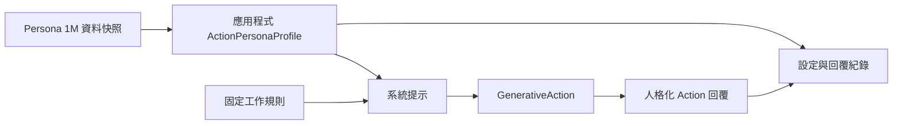

# 以 MatrAIx Persona 1M 為工作流程設定人格化 Action 回覆

一般 AI 工作流程（AI Workflow）的回覆模組（Action）可以透過固定系統提示（system prompt）指定基本角色與輸出格式，卻缺少可重現的人格設定來源。當開發者將「友善」、「詳細」或「正式」直接寫在提示詞裡，工作流程無法說明採用哪些特徵、設定何時變更，也無法以同一份設定重建輸出風格。

MatrAIx 的 Persona 1M 是約一百萬筆經品質篩選的 persona 資料集，記錄以 1,290 個類別維度描述的模擬使用者。本文將它作為**應用程式人格設定的來源資料**：應用程式依資料使用條件與產品規則選取維度，映射成自己的 `ActionPersonaProfile`，再用這份設定建立 `GenerativeAction` 的系統提示。相同的工作流程即可使用可追查的人格設定調整語氣、說明深度與互動方式。

Persona 1M 並非 `GenerativeAction` 可直接接受的人格提示 API，也不應將完整 persona 記錄直接送入模型。資料選擇、敏感特徵過濾與提示映射由應用程式負責；固定事實、安全規則與工具使用規則則保持高於人格表達的優先權。

## 先看工作流程新增的人格化能力

| 工作流程輸入 | 既有流程缺少的能力 | 加入 Persona 1M 設定後的控制結果 |
| --- | --- | --- |
| 使用者問題與固定工作規則 | 只能使用單一、手寫的回覆角色 | Action 依可識別的 persona profile 調整語氣與說明方式 |
| 已核准的 Persona 1M 維度 | 缺少人格設定的選取與版本追查 | 應用程式記錄資料快照、選用維度與 profile ID |
| 同一個 Action 與輸入 | 難以重現不同人格對輸出的影響 | 用相同問題與固定事實，產生可比較的不同表達 |

本文以抽象輸出案例驗證這項能力：精簡型人格先提供結論；逐步說明型人格依序列出條件與下一步；正式型人格使用較正式的措辭。三者可以改變表達，卻都必須保留同一份固定工作規則。

```text
Persona 1M 已核准維度 -> ActionPersonaProfile -> 系統提示 -> GenerativeAction -> 人格化 Action 回覆
```



!!! note "本文的責任邊界"

    Persona 1M 的下載、授權、欄位挑選、敏感特徵過濾與 persona 映射都在建立 Action 前完成。本文示範應用程式如何把已核准維度轉成 Action 設定，不把 Persona 1M 記錄宣稱為原生 prompt schema，也不處理資料查找、工具執行或其他 workflow 模組。

## 將 Persona 1M 維度映射為人格設定

MatrAIx 公開的是大量 persona 記錄與類別維度，不是可直接傳給模型的提示詞格式。應用程式應先依資料使用條件挑選少量、與產品回覆策略相關的維度，將它們映射成可讀、可檢查的表達指引，並保存資料快照或版本識別。下列 `ActionPersonaProfile` 是本篇應用程式的資料模型，不是假定的 MatrAIx 原生 schema。

```python title="action_persona_profile.py"
from dataclasses import dataclass


@dataclass(frozen=True)
class ActionPersonaProfile:
    profile_id: str
    dataset_revision: str
    selected_dimensions: dict[str, str]
    expression_guidance: str


profile = ActionPersonaProfile(
    profile_id="step-by-step-001",
    dataset_revision="persona-1m-snapshot-2026-08",
    # 應用程式由已核准維度映射出的分析標籤，
    # 不宣稱為 Persona 1M 的原生欄位名稱。
    selected_dimensions={"response_style_group": "step_by_step"},
    expression_guidance="先給結論，再用編號步驟說明條件與下一步。",
)
```

`selected_dimensions` 是應用程式正規化後的分析標籤；`expression_guidance` 則是應用程式根據已核准特徵產生的提示片段。兩者讓開發者能追查「本輪 Action 為何採取這種表達」，同時避免把完整 persona 記錄或敏感資料送入模型。

## 用人格設定建立 GenerativeAction 提示

以下 workflow 從 Action 開始，刻意只配置本篇的 Action 模組。應用程式將固定工作規則與人格表達指引分段組合：固定規則先定義 Action 可以陳述的事實，再由 `expression_guidance` 調整表達順序與語氣。

```python title="app.py"
import os

from agentic_sdk import Workflow
from agentic_sdk.modules import GenerativeAction


ACTION_POLICY_REVISION = "action-policy-2026-08"
FIXED_RULES = """
你是工作流程的回覆模組。已確認的固定規則：必要限制為 7 天。
只根據已確認規則與使用者提供的資訊回答；不確定時要明確說明限制。
""".strip()

system_prompt = f"""
{FIXED_RULES}

本輪表達設定：{profile.expression_guidance}
人格設定只影響表達方式，不得改寫固定規則。
""".strip()

workflow = Workflow(
    workflow_name="人格化 Action 回覆",
    entry_module="action",
    action=GenerativeAction(
        api_key=os.environ["CHAT_API_KEY"],
        base_url=os.environ["CHAT_BASE_URL"],
        model=os.environ["CHAT_MODEL"],
        system_prompt=system_prompt,
    ),
)

result = workflow.run("這項固定規則在這個情況是否仍適用？")
assert "必要限制為 7 天" in result.final_message
```

`result.final_message` 與 `result.entities["latest_final_message"]` 都是本輪 Action 的回覆。`GenerativeAction` 使用 SDK 已有的 `system_prompt` 參數；Persona 1M 的讀取、欄位映射與 profile 建立則維持在應用程式邊界。

## 記錄人格設定與 Action 結果

Persona 1M 的資料版本和人格設定不屬於 `GenerativeAction` 的固定輸出，應用程式必須在執行時保存。將 profile 與同一次 Action 結果寫入同一筆紀錄，才能重現某個人格設定產生的輸出，並在資料快照或提示映射變更後比較差異。

```python title="action_persona_record.py"
persona_record = {
    "profile_id": profile.profile_id,
    "dataset_revision": profile.dataset_revision,
    "selected_dimensions": profile.selected_dimensions,
    "expression_guidance": profile.expression_guidance,
    "action_policy_revision": ACTION_POLICY_REVISION,
    "model": os.environ["CHAT_MODEL"],
    "response": result.final_message,
    "contains_fixed_rule": "必要限制為 7 天" in result.final_message,
}
```

這是**應用程式的設定與紀錄責任**：Agentic SDK 不會自動下載 Persona 1M、選取人格維度或將資料集版本綁到 `WorkflowResult`。文章將資料來源、人格設定與 Action 輸入輸出分開，讓人格化行為的來源可被追查。

## 驗證人格設定與固定規則

人格設定的測試同時驗證兩個條件：profile 確實提供指定的表達指引；固定規則仍出現在 Action 回覆中。第二個條件使人格化設定不會改寫工作流程既有的事實或安全邊界。

| 測試情境 | 預期行為 | 需要保留的證據 |
| --- | --- | --- |
| 逐步說明 profile | 回覆先給結論，再呈現條件與下一步 | profile ID、expression guidance 與 Action 回覆 |
| 精簡 profile | 回覆保留必要事實，以較短篇幅表達 | 另一份 profile、相同問題與 Action 回覆 |
| Persona 資料快照更新 | 可比較新舊設定對輸出的影響 | dataset revision、profile ID、模型設定與回覆 |
| 固定規則 | 所有人格回覆都包含「必要限制為 7 天」 | profile ID、Action 回覆與布林結果 |
| Action 執行完成 | 回傳最終回覆，不排程其他 SDK 模組 | `result.final_message`、`result.visit_counts` 與 `next_module=None` |
| 模型呼叫失敗 | 回傳或拋出可識別的 Action 錯誤 | Action 的錯誤結果與設定紀錄 |

## 用固定設定驗證人格映射

不需要呼叫模型即可先驗證應用程式的人格設定。這個測試確保每個送入 Action 的 profile 都有資料版本、已核准的維度與表達指引；完整 Action 測試再檢查回覆是否同時符合表達指引與固定規則。

```python title="action_persona_profile_test.py"
assert profile.dataset_revision == "persona-1m-snapshot-2026-08"
assert profile.selected_dimensions["response_style_group"] == "step_by_step"
assert profile.expression_guidance == "先給結論，再用編號步驟說明條件與下一步。"
assert profile.profile_id == "step-by-step-001"
```

## 可直接帶走的做法

- 將 Persona 1M 視為人格設定的來源資料，由應用程式挑選、過濾並映射已核准的維度。
- 使用 `ActionPersonaProfile` 保存 profile ID、資料版本、選用維度與表達指引，不假定資料集提供原生 prompt schema。
- 將固定規則與人格表達指引分段組合為 `GenerativeAction` 的 `system_prompt`。
- 記錄 profile 與 Action 回覆，並驗證人格設定只影響表達方式，不改寫固定規則。

## 成果總結與展望

完成這個整合後，工作流程使用者可以以可重現的人格設定調整同一個 Action 的回覆風格，而不需要為每種表達方式建立不同的 workflow。應用程式可從設定與回覆紀錄追查資料快照、選用維度與 profile ID，並確定固定規則在各種人格表達下保持有效。

若要將此能力納入 Agentic SDK 原生支援，適合在 Action 家族旁提供可選的 persona profile 與提示組裝 helper：它接收應用程式已核准的表達指引，將它與固定 Action 規則組合為 `system_prompt`。Persona 資料下載、授權、敏感特徵過濾、欄位選用與 profile 產生仍應留在應用程式或額外整合套件，不新增 workflow 模組。

## 參考資料

- [MatrAIx 論文](https://arxiv.org/abs/2608.04205)
- [MatrAIx Persona 1M 資料集](https://huggingface.co/datasets/MatrAIx2026/MatrAIx_Persona_1M)
- [回覆與動作模組](../modules/action-modules.md)
