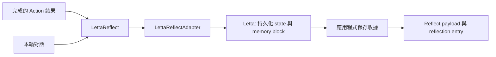

# 別把雨天備案存成偏好：用 Letta 沉澱真正長期有效的資訊

旅遊規劃助手最難的地方不是記住更多對話，而是分辨哪些話值得被記住。使用者先確認「兩人同行，其中一人不能吃海鮮」「住宿靠近車站」，隔天又說「第二天改成下雨」。前兩項會影響之後每一次建議；最後一項只描述今天的情況。若系統一律保存，往後的晴天行程也可能被錯誤地排成室內活動。

這篇文章以這個情境示範：回覆模組（Action）已完成一輪回答後，反思模組（Reflect）如何判定可長期沿用的資訊，再交給 Letta 的持久化 state 與 memory block 能力保存。讀完後，你會得到一個可替換的 `LettaReflect` 邊界，以及一份能說明「這次到底請求保存什麼、為什麼保存」的結果收據。

## 先看使用者感受到的差異

| 情境 | 沒有沉澱規則時 | 加入 LettaReflect 後 |
| --- | --- | --- |
| 使用者確認不吃海鮮 | 偏好可能只留在逐漸被截斷的對話裡 | Reflect 將已確認限制交給 Letta 保存，後續流程可依收據追查 |
| 使用者補充靠近車站 | 新限制容易和舊對話混在一起 | 保存結果包含候選識別與命名空間，可知道本輪新增了什麼 |
| 當天改成下雨 | 雨天備案可能被誤當固定偏好 | Reflect 僅留下本輪反思，不建立長期保存候選 |

本文只深入這條流程中由 Reflect 接手的一段：它接收完成的 Action 結果與當前對話，決定是否保存，並回傳統一結果。下一輪如何查回資料、如何排序候選，以及查回內容如何送入 Action，都是相鄰流程的責任，不會在這裡假裝已經完成。

```text
Action 結果 -> LettaReflect -> 應用程式 Letta adapter -> Letta memory block -> Reflect 結果
```



!!! note "本文的責任邊界"

    本文只驗證 Reflect 對「是否保存」的判定與保存收據。下一輪如何查回資料、如何排序候選，以及查回內容如何送入 Action，分別屬於應用程式與其他模組的設計，並未在這個範例中實作。

## 從回覆中區分可沉澱資訊

本案例以 Action 的候選回覆作為 Reflect 輸入。LettaReflect 依可追查的規則區分長期資訊與本輪暫時安排。

| Action 結果中的資訊 | Reflect 判定 | 理由 |
| --- | --- | --- |
| 同行者不能吃海鮮 | 建立可保存候選 | 會影響後續餐廳與行程安排 |
| 住宿靠近車站 | 建立可保存候選 | 是已確認的交通限制 |
| 雨天改到室內景點 | 僅記錄本輪反思 | 依當日條件成立，不代表固定偏好 |
| 尚待使用者確認的景點 | 不建立候選 | 尚未成為已確認資訊 |

這張表是 LettaReflect 的資料判定規格。Action 只產生候選回覆；LettaReflect 才決定候選回覆中的資訊是否交給應用程式寫入 Letta memory block。

## 先確認兩份會交接的契約

這個案例的關鍵不是假設任意字典都能被保存，而是先說清楚 Action 與 Letta adapter 要提供什麼。SDK 內建的 `DirectAnswerAction`、`GenerativeAction` 與 `ToolCallAction` 都會把最終文字寫成 `state.last_action_result["content"]`；若你使用自訂 Action，也需要建立同一個欄位，Reflect 才有明確輸入。

| 交接點 | 最小要求 | 缺少時的結果 |
| --- | --- | --- |
| Action -> LettaReflect | `last_action_result["content"]` 是非空字串 | Reflect 記錄 `reflect_verdict="fail"`；`durable_memory_status="skipped"` 只表示沒有嘗試保存，不表示 Reflect 沒有執行 |
| LettaReflect -> adapter | Action 文字、對話內容、workflow 名稱與 session ID | adapter 依應用程式規則整理候選並寫入 Letta memory block |
| adapter -> LettaReflect | verdict、原因、保存狀態、候選識別與記憶 block 參照 | Reflect 將應用程式收據轉為 SDK payload 與 reflection entry |

Letta 官方文件說明 state、訊息與 memory blocks 會被持久化，且 memory block 可由開發者透過 API 編輯；它沒有定義本篇的候選萃取規則、收據格式或 embedding revision。`LettaReflectAdapter` 因此是你實作外部整合的位置，而不是 SDK 已經附帶的 Letta client。它需要由應用程式決定認證方式、memory block 參照、候選整理規則、超時與重試策略；本文只固定它交回 SDK 的收據格式。

## 將 Letta 設為 Reflect 的轉接邊界

Letta 轉接器負責兩件事：依應用程式規則從 Action 結果與本輪上下文整理可保存候選，再透過 Letta API 寫入或更新 memory block。第三件事是回傳**應用程式定義的**保存收據。SDK 端只依賴這個轉接契約，不假定 Letta client 的特定 API 名稱或 Letta 會自動萃取、嵌入內容。

```python title="letta_reflect_contract.py"
from dataclasses import dataclass
from typing import Protocol


@dataclass(frozen=True)
class LettaReflectionReceipt:
    verdict: str
    reason: str
    durable_memory_status: str
    durable_memory_count: int
    candidate_ids: tuple[str, ...]
    memory_namespace: str
    memory_block_id: str | None


class LettaReflectAdapter(Protocol):
    def reflect_and_persist(
        self,
        *,
        action_result: str,
        conversation_context: str,
        workflow_name: str,
        session_id: str,
    ) -> LettaReflectionReceipt: ...
```

`LettaReflectionReceipt` 是本篇的 adapter 資料模型，不是 Letta API response。轉接器的實作應記錄 Letta client 或服務版本、memory block 參照與保存結果。`candidate_ids` 可對應本輪成功處理的候選內容；`memory_namespace` 與 `memory_block_id` 讓同一筆收據能追查到資料落點。這些資料將「本輪 Action 結果」連到「哪些候選被寫入 memory block」，用於追查後續行為差異。

## 用 LettaReflect 回傳統一的 Reflect 結果

`LettaReflect` 是此案例唯一替換的 SDK 模組。同一個 Reflect 結果同時表達 Action 結果是否可處理，以及長期資訊是否已成功沉澱。

```python title="letta_reflect.py"
from agentic_sdk import ContextEntry, ContextEntryType, ModuleOutput, WorkflowState


class LettaReflect:
    name = "reflect"

    def __init__(self, adapter: LettaReflectAdapter) -> None:
        self.adapter = adapter

    def __call__(self, state: WorkflowState) -> ModuleOutput:
        action_result = state.last_action_result or {}
        content = str(action_result.get("content", "")).strip()
        if not content:
            return ModuleOutput(
                next_module=None,
                payload={
                    "reflect_verdict": "fail",
                    "durable_memory_status": "skipped",
                    "durable_memory_count": 0,
                },
                context_updates=[
                    ContextEntry(
                        type=ContextEntryType.REFLECTION,
                        content="verdict=fail reason=missing action result",
                        metadata={"strategy": "letta_reflect", "reason": "missing action result"},
                    )
                ],
            )

        conversation_context = state.memory.as_text_transcript() if state.memory is not None else state.user_message
        receipt = self.adapter.reflect_and_persist(
            action_result=content,
            conversation_context=conversation_context,
            workflow_name=state.workflow_name,
            session_id=state.session_id,
        )
        return ModuleOutput(
            next_module=None,
            payload={
                "reflect_verdict": receipt.verdict,
                "durable_memory_status": receipt.durable_memory_status,
                "durable_memory_count": receipt.durable_memory_count,
                "durable_memory_candidate_ids": list(receipt.candidate_ids),
                "durable_memory_namespace": receipt.memory_namespace,
                "durable_memory_block_id": receipt.memory_block_id,
            },
            context_updates=[
                ContextEntry(
                    type=ContextEntryType.REFLECTION,
                    content=f"verdict={receipt.verdict} reason={receipt.reason}",
                    metadata={
                        "strategy": "letta_reflect",
                        "reason": receipt.reason,
                        "durable_memory_status": receipt.durable_memory_status,
                        "durable_memory_count": receipt.durable_memory_count,
                        "candidate_ids": list(receipt.candidate_ids),
                        "memory_namespace": receipt.memory_namespace,
                        "memory_block_id": receipt.memory_block_id,
                    },
                )
            ],
        )
```

`next_module=None` 結束這次 Reflect。`reflect_verdict` 表達本輪結果是否可處理；`durable_memory_status` 與 `durable_memory_count` 只表達 Letta 保存作業的狀態。當 Action 結果不存在時，Reflect 已執行並留下失敗 entry，但保存作業以 `skipped` 表示未嘗試；Letta 服務無法保存時，轉接器則回傳 `failed` receipt。文件不將任一情況表示成查回資料失敗。

## 用完成的 Action 結果驗證 Letta Reflect

Reflect 的輸入契約是已完成的 `last_action_result` 與目前對話。以下範例建立符合該契約的 `WorkflowState`，只驗證 LettaReflect 的輸入與輸出，不配置或實作 Action。

```python title="reflect_state_fixture.py"
from agentic_sdk import InContextMemory, WorkflowState


user_message = "第二天改成下雨，行程怎麼調整？"
memory = InContextMemory()
memory.append_message("user", user_message)

state = WorkflowState(
    user_message=user_message,
    workflow_name="旅遊規劃助手",
    session_id="travel-session-001",
    memory=memory,
)
state.last_action_result = {
    "content": "雨天改到室內景點，午餐仍排除海鮮。",
}
```

在完整工作流程中，SDK 會在 Action 完成後呼叫 Reflect；這是 LettaReflect 所依賴的既有輸入契約。下一節以這個 `state` 搭配 fake adapter 驗證 Reflect 輸出；應用程式可從 Reflect 的 payload 與 reflection entry 讀取本輪判定與保存狀態。

## 用 fake adapter 驗證 Reflect 契約

測試不需要連到 Letta 服務。以固定 receipt 的 fake adapter 驗證 `LettaReflect` 是否交出正確輸入與可觀察結果，將外部服務測試留給 adapter 自己的整合測試。

```python title="reflect_contract_test.py"
from dataclasses import dataclass


@dataclass
class FakeLettaAdapter:
    receipt: LettaReflectionReceipt
    received_action_result: str | None = None

    def reflect_and_persist(self, **kwargs: str) -> LettaReflectionReceipt:
        self.received_action_result = kwargs["action_result"]
        return self.receipt


adapter = FakeLettaAdapter(
    receipt=LettaReflectionReceipt(
        verdict="pass",
        reason="confirmed dietary restriction",
        durable_memory_status="stored",
        durable_memory_count=1,
        candidate_ids=("memory-candidate-001",),
        memory_namespace="travel-planner",
        memory_block_id="block-travel-preferences",
    )
)
result = LettaReflect(adapter)(state)

assert adapter.received_action_result == "雨天改到室內景點，午餐仍排除海鮮。"
assert result["payload"]["durable_memory_status"] == "stored"
assert result["payload"]["durable_memory_candidate_ids"] == ["memory-candidate-001"]
assert result["context_updates"][0].metadata["memory_block_id"] == "block-travel-preferences"
```

這是 `LettaReflect` 的模組測試，不是 Letta 服務整合測試。真正接上服務後，adapter 的整合測試應另外驗證命名空間、認證、超時，以及候選識別在你選用的 Letta 儲存策略中可被追查；查回策略仍是另一條流程的測試範圍。

## 用收據驗證 memory block 寫入

驗證條件以 Reflect 的輸入、收據與輸出為準，避免將「下次是否找回」混入本篇的責任範圍。

| 情境 | LettaReflect 預期結果 | 需要保留的證據 |
| --- | --- | --- |
| 沒有可保存資訊 | `pass`、`skipped`、計數為 0 | reflection entry 與 receipt；不需要候選識別碼 |
| 使用者確認飲食限制 | `pass`、`stored`、計數大於 0 | 候選內容、candidate ID、memory block 參照與保存收據 |
| 使用者更新住宿偏好 | `pass`、`stored`，收據可追查取代關係 | 新舊候選識別、命名空間與保存收據 |
| Letta 保存失敗 | `fail`、`failed`、計數為 0 | 轉接器錯誤原因與 reflection entry；不將失敗內容當成已保存 |
| Action 沒有結果 | `fail`、`skipped`、計數為 0 | `missing action result` 的 reflection entry |

測試應固定 Action 結果、對話上下文與 Letta 轉接器回傳值，再比對 Reflect 的 payload、reflection metadata 與轉接器接收的輸入。這讓候選判定、memory block 寫入與 SDK Reflect 輸出可分別驗證。

## 可直接帶走的做法

- 由 Action 產生候選回覆，由 LettaReflect 判定其中哪些資訊可沉澱。
- 以轉接器封裝 Letta memory block 的寫入與保存，不在 SDK 文件中假定特定 client 方法或未驗證的自動萃取能力。
- 以單一 Reflect 結果回傳 verdict、保存狀態與保存數量。
- 使用 reflection entry 與保存收據驗證結果，不將後續資料查回納入這個 Reflect 的責任。

## 成果總結與展望

完成這個整合後，使用者得到的功能是：系統能在每輪回覆完成後，將已確認且可長期沿用的資訊從暫時安排中區分出來，並取得可追查的 memory block 保存結果。使用者不需要把「是否保存」的判定散落在 Action 或呼叫端；應用程式可依 Reflect 的 verdict、保存狀態和收據處理本輪結果。

若要將此能力納入 Agentic SDK 原生支援，適合以 Reflect 家族的可選整合提供 `LettaReflect`，並維持本篇的 `LettaReflectAdapter` 邊界：SDK 只要求候選判定、memory block 保存與收據的契約，Letta client、認證與命名空間設定由應用程式或額外整合套件提供。這能讓 SDK 保持對外部服務實作的獨立性，也讓未來替換持久化服務時不需要改動 Reflect 模組的輸入與輸出。

## 參考資料

- [Letta 文件](https://docs.letta.com/)
- [Letta GitHub 專案](https://github.com/letta-ai/letta)
- [安全控制模組](../modules/reflect-modules.md)